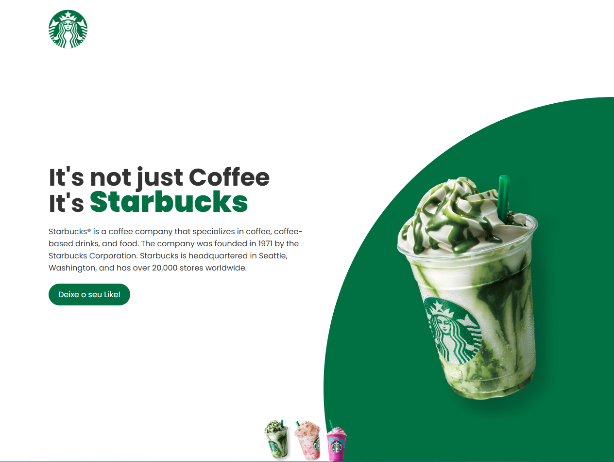

## Projeto Starbucks - Missão Programador do Zero

**O que é?**

Este projeto é uma landing page simulada da Starbucks, construída durante o evento Missão Programador do Zero. Ele apresenta a marca Starbucks, seus produtos e utiliza efeitos interativos para mudar a imagem principal e a cor de fundo.

**Design:**


**Tecnologias utilizadas:**

* HTML: Estrutura básica da página.
* CSS: Estilos visuais e layout da página.
* JavaScript: Funcionalidades interativas.

**Como rodar o projeto:**

1. **Pré-requisitos:**
    * Ter um navegador web instalado, como Google Chrome, Mozilla Firefox, etc.
    * (Opcional) Ter um editor de código, como Visual Studio Code, para visualizar e editar os arquivos do projeto.

2. **Clone o repositório do projeto:**

    Abra o seu terminal ou prompt de comando e use o seguinte comando para clonar o repositório do projeto do seu GitHub:

    ```bash
    git clone https://github.com/seu-usuario/projeto-starbucks.git
    ```

    Substitua `seu-usuario` pelo seu nome de usuário no GitHub.

3. **Acesse a pasta do projeto:**

    Após o clone ser finalizado, navegue até a pasta do projeto usando o comando `cd`:

    ```bash
    cd projeto-starbucks
    ```

4. **Abra o arquivo index.html em seu navegador:**

    * Abra seu navegador web.
    * Arraste e solte o arquivo `index.html` localizado na pasta do projeto para a janela do navegador, ou use o atalho `Ctrl+O` (Windows/Linux) ou `⌘ + O` (Mac) para abrir o arquivo.

**Observação:**

* Se você preferir editar os arquivos do projeto, pode utilizar um editor de código como o Visual Studio Code.
* Certifique-se de que os arquivos HTML, CSS e JavaScript estejam salvos na mesma pasta para que o projeto funcione corretamente.

**Vamos lá! Explore o código e divirta-se personalizando a sua landing page Starbucks!**
